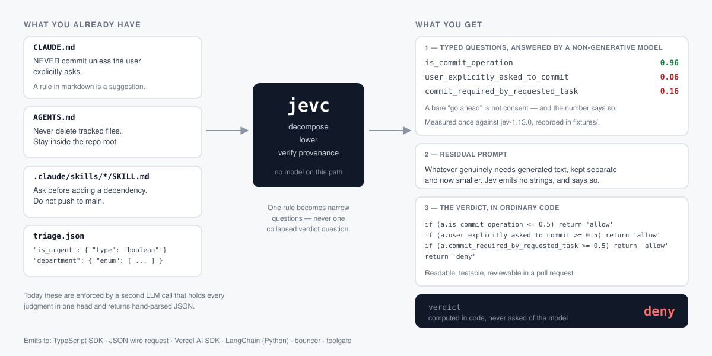

# jevc

**Turn the rules your agent keeps ignoring into gates you can test.**

Your `CLAUDE.md` says *NEVER commit unless the user explicitly asks*, and the agent commits
anyway — because a markdown rule is a suggestion the model re-reads fresh every turn.
`jevc` compiles a rule like that into a **Jev program**: a few narrow typed questions
answered by TypeSafe's System One model (`jev-1.13.0` — non-generative, returns
probabilities, never text), plus a reducer that computes the verdict in ordinary code. The
rule stops being prose the model weighs and becomes an invariant you can read, diff and
unit-test.

It is for anyone shipping a gate an LLM currently judges — a Claude Code `PreToolUse` hook,
a tool-call guard, a model router, an output verifier — who needs that decision to be
reproducible and reviewable.

## Start here

```bash
npm install -g jev-compiler    # the package is jev-compiler; the command it installs is jevc
jevc check                     # replays the recorded corpus, offline
jevc scan .                    # what this project could enforce
```

From source instead: `git clone https://github.com/doronp/jevc && cd jevc && npm install && npm run build`,
then `npx jevc …` from the checkout. Node >= 22 to run the test suite.

```console
$ npx jevc check
58 fixtures, 58 passing, 0 failing
```

No API key, no network — not for the tests, the examples, or anything in this README
except `jevc check --live`.

---

## Your rules are already in the repo

Point `jevc scan` at a project. It finds the instruction files agent harnesses actually
read — `CLAUDE.md`, `AGENTS.md`, `GEMINI.md`, `.cursorrules`,
`.github/copilot-instructions.md`, `.claude/skills/**`, `.claude/agents/**` — and sorts
what it finds into what can be enforced and what cannot:

```console
$ npx jevc scan examples/sample-project
examples/sample-project

  CLAUDE.md                          13 rules     7 decidable     4 procedure     2 generation
  AGENTS.md                           7 rules     5 decidable     2 procedure     0 generation
  .claude/skills/release/SKILL.md    12 rules     4 decidable     6 procedure     2 generation

32 rules across 3 files. 16 look decidable — those are the ones that can become typed Jev questions.

Start with CLAUDE.md, which has the most:

     7  NEVER commit unless the user explicitly asks. Produce the message; let the human ru…
     8  Never delete tracked files. If something looks unused, say so and stop.
     9  Do not push to `main`. Open a branch and a PR.
    10  Ask before adding a dependency. We audit the lockfile by hand every release.
    11  Migrations under `db/migrations/` are append-only once merged. Write a new one inst…
        … and 2 more

Next:

  jevc compile examples/sample-project/CLAUDE.md --lift

  Hand the request it prints to the agent you already have open. No second API key.
...
```

The `...` is one elided paragraph: `scan`'s own note that this classification is a text
heuristic and the list is worth reading rather than the counts
([why that is fine here](#jevc-scan-is-a-heuristic-and-the-only-one-here)).

A prompt braids three different things together, and only one of them compiles:

| Part | Example | Compiles? |
| --- | --- | --- |
| **Decision** | "is this command dangerous?", "which team owns this?" | **yes** |
| **Generation** | "write a summary", "explain your reasoning" | **never** — Jev emits no text |
| **Procedure** | "read the file before editing it" | **no** — that is control flow; it belongs in code |

No tool can turn a whole prompt into an equivalent Jev program.
`jevc` separates them, and every compilation emits all three parts: the decision set, the
**residual prompt** for whatever genuinely still needs a generative model, and the wiring
that evaluates the first and calls the LLM only for the second. A compilation that produces
no decisions is a valid answer — that prompt had no System One content, and `jevc` says so
instead of inventing questions.

`jevc compile <file> --lift` prints a lowering request for the agent you already have open
(Claude Code, Codex, Cursor), which returns candidate decisions as JSON. No second API key,
no second bill. JSON Schema is still a first-class input — it is just no longer the front
door, because your existing files are.

### Before and after, for one rule

**Before.** The rule lives in `CLAUDE.md` and the model weighs it against everything else
in the file. It usually holds. When it does not, there is nothing to inspect: no record of
which part was weighed, no way to write a test, and the only available fix is to make the
sentence louder. Escalating to a second LLM call — *"you are a policy checker, return
JSON"* — trades one unreviewable judgment for another and bills you for it. That prompt is
real, and it is in this repo: 1,089 characters of instructions, four judgments held in one
head, a hand-parsed JSON envelope (`fixtures/agent-harness-rules.json`,
`commit-only-when-explicitly-asked`).

**After.** Three typed questions. Measured against the fixture's state — a user who said
*"yeah that reading looks right, go ahead"* and an agent that decided to commit:

```
is_commit_operation                 0.96
user_explicitly_asked_to_commit     0.06     <- a bare approval is not consent
commit_required_by_requested_task   0.16

verdict, computed in code:          deny
```

And the verdict is a block you can read in a pull request:

```json
"rules": [
  { "when": [{ "id": "is_commit_operation",               "op": "lte", "value": 0.5 }], "then": "allow" },
  { "when": [{ "id": "user_explicitly_asked_to_commit",   "op": "gte", "value": 0.5 }], "then": "allow" },
  { "when": [{ "id": "commit_required_by_requested_task", "op": "gte", "value": 0.5 }], "then": "allow" }
],
"otherwise": "deny"
```

Change a threshold and see which recorded cases move. Add a case and run it. The judgment
that used to live in a paragraph now lives in three lines and a number you can point at.

```bash
npx tsx examples/02-agents-md-guardrail.ts   # the reasoning
cd examples/sample-project                   # the gate, installed in the project the rule came from
JEVC_REPLAY=1 node .claude/gates/gate.mjs < .claude/gates/payload.sample.json
```

### And for a skill

`scan` above found `.claude/skills/release/SKILL.md — 12 rules, 4 decidable`. Those four
gates are the reason the skill exists, and they are not all the same kind of thing:

| Gate in the skill | Becomes |
| --- | --- |
| A release must never go out with a failing test. | **code** — `npm test` has an exit code. Nothing to judge |
| Never release on a Friday after 16:00 local time. | **code** — a clock |
| The changelog must mention every change touching `src/billing/`. | **a Jev question** — whether prose covers a diff has no exit code |
| Do not bump the major version without an approved RFC. | **both** — semver in code, "does the RFC cover *this* change?" in Jev |

Two of the four leave the model entirely. That is the win: most of what reads like judgment
in a skill is a fact nobody bothered to look up. The two that remain are
[`examples/sample-project/.claude/gates/release.json`](examples/sample-project/.claude/gates/release.json),
and here is the whole gate — including the line each question came from, carried into the
policy as a comment:

```console
$ npx jevc emit-policy --for bouncer examples/sample-project/.claude/gates/release.json
# changelog_covers_billing_changes: .claude/skills/release/SKILL.md:13 — The changelog must mention every change touching `src/billing/`.
# rfc_covers_this_breaking_change: .claude/skills/release/SKILL.md:14 — Do not bump the major version without an approved RFC.
...
  rules:
    - when:
        changelog_covers_billing_changes:
          p: <=0.5
      then: deny
    - when:
        rfc_covers_this_breaking_change:
          p: <=0.5
      then: deny
    - default: allow
```

Before: a page the agent re-reads each time and mostly follows. After: a Friday 16:05
release is stopped by an `if`, and a changelog that skipped the billing change is stopped
by a number — with the skill line that asked for it printed beside the rule.

The `...` elides the generated header and the tool list, both shown in full under
[Emitting a policy](#emitting-a-policy).

---

## Wire it in

The rule this whole page has been following came out of one file —
[`examples/sample-project/CLAUDE.md`](examples/sample-project/CLAUDE.md), line 7 — and the
compiled gate goes back into that same project, which is where the loop closes. The hook
lives in its `.claude/gates/`, the `.claude/settings.json` beside it registers it, and the
whole thing runs offline right now:

```console
$ cd examples/sample-project
$ JEVC_REPLAY=1 node .claude/gates/gate.mjs < .claude/gates/payload.sample.json
{"hookSpecificOutput":{"hookEventName":"PreToolUse","permissionDecision":"deny","permissionDecisionReason":"CLAUDE.md line 7: commits need an explicit request. …"}}
```

The registration is [that project's `.claude/settings.json`](examples/sample-project/.claude/settings.json),
which is the whole file:

```json
{
  "hooks": {
    "PreToolUse": [
      { "matcher": "Bash",
        "hooks": [{ "type": "command", "command": "node $CLAUDE_PROJECT_DIR/.claude/gates/gate.mjs" }] }
    ]
  }
}
```

For your own project: copy that `.claude/` directory, change the import in `gate.mjs` from
the relative `dist/` path to `jevc`, and set `TYPESAFE_API_KEY` in the environment Claude
Code runs in. [`examples/sample-project/README.md`](examples/sample-project/README.md) walks
the round trip — scan, lift, compile, install, run — one command at a time.

[**`docs/wiring.md`**](docs/wiring.md) has one recipe per surface, with the code that
actually runs:

| Where the decision happens | Recipe |
| --- | --- |
| Claude Code stops a tool call | `PreToolUse` hook |
| Claude Code runs the compiler for you | a `.claude/commands/jev.md` slash command |
| Your own TypeScript agent loop | `--emit sdk` |
| A Vercel AI SDK app | `--emit ai-sdk` |
| A Python agent — LangChain, LangGraph, your own | `--emit langchain`, or subprocess the gate |
| A gateway whose source you do not own | `emit-policy --for bouncer` / `--for toolgate` |
| Anything that can POST | `--emit json` |

---

## Examples

Four runnable examples, plus the corpus itself. All offline.

```bash
npx tsx examples/01-schema-to-jev.ts       # schema -> Jev, with the residual left visible
npx tsx examples/02-agents-md-guardrail.ts # a CLAUDE.md rule, enforced
npx tsx examples/03-model-router.ts        # route before you spend; level-index scores
npx tsx examples/04-policy-emit.ts         # emit a bouncer policy; watch toolgate refuse
```

The 58 recorded fixtures are the worked examples — each one a prompt from a real harness,
run once against the live model and recorded. Read one end to end:

```bash
npx jevc show                                   # list all 58
npx jevc show bash-rm-rf-node-modules-benign    # the prompt it replaces, the questions, the answers
```

[`examples/GALLERY.md`](examples/GALLERY.md) is all 58 on one page, generated from
`fixtures/` by `npm run gallery` so it cannot drift from what the tests assert. Worth
opening first:

| Domain | Fixture |
| --- | --- |
| agent-harness-rules | `commit-only-when-explicitly-asked` — the one above |
| security-guardrails | `bash-rm-rf-node-modules-benign` — the decomposition law's adversarial negative |
| cost-optimization | `tier-router-ambiguous-scope-error-handling` — the 0.24-confidence tier head |
| intent-understanding | `instructor-multilabel-is-n-nouls` — an array of enum becomes one noul per label |
| output-verification | `agent-neutered-the-test-instead-of-fixing` — "done" is a claim, not a fact |

`jevc explain` answers the other question — why does this particular question exist:

```console
$ npx jevc explain user_explicitly_asked_to_commit
user_explicitly_asked_to_commit  (agent-harness-rules/commit-only-when-explicitly-asked)
  type:         noul
  instructions: Looking only at recent_user_turns, did the human explicitly ask for a commit to be created?
  provenance:   Claude Code permissions docs ship this exact split as their worked example: ...
  measured:     {"type":"noul","noul":0.06}
  replaces:     You are a policy checker running inside our Claude Code PreToolUse hook. We keep getting surprise commits from the agent...
```

The `...` on `replaces:` is the CLI's own truncation; the one on `provenance:` is this
README's — `explain` prints the whole citation.

---

## Why it works: the decomposition law

Every lint rule below comes from one measurement.

**Jev answers narrow evidence questions decisively and collapsed verdict questions
near-randomly — on borderline inputs, which are the ones a gate exists for.** Every number
below comes from **one** recorded call evaluating `rm -rf node_modules`
(`fixtures/security-guardrails.json`, `bash-rm-rf-node-modules-benign`, jev-1.13.0):

| Question in that call | Answer | Confidence |
| --- | --- | --- |
| `decision` — allow/ask/block, the collapsed verdict | allow 0.42 / block 0.35 / ask 0.23 | **0.13** |
| `blast_radius` — score, 4 levels | 1.02 ("only regenerable artifacts") | **0.97** |
| `only_regenerable_artifacts` — noul | 0.93 | — (a noul has none) |

The decomposed heads are right and certain. The verdict head put `allow` 0.07 ahead of
`block` — the smallest winner/runner-up margin anywhere in the corpus, and only seven times
the ±0.01 that repeated identical calls drift by. A 0.07 margin is all that
keeps this gate from blocking `rm -rf node_modules`, which would not be a guard, it would
be an outage.

The same shape shows up where it costs money rather than uptime. In
`tier-router-ambiguous-scope-error-handling`, the collapsed "which model tier?" question
answered **fast at confidence 0.24** for a file that emits the billing webhook, while the
evidence questions in the same call said `request_scope_ambiguous` 0.79 and
`touches_irreversible_surface` 0.76. Reading the argmax ships a silent downgrade; reducing
the evidence in code routes it up. (`npx tsx examples/03-model-router.ts`.)

Three rules follow, all enforced by `lintProgram` — three of the six checks it runs:

1. **Never emit a collapsed verdict question.** Emit evidence; compute the verdict in code.
   This one is a hard error.
2. **Never emit two questions where one's answer determines the other's.** Questions in a
   batch are scored independently with no consistency enforced — one measured response
   asserted `rule_conflict = documented_exception_wins` (p 0.52, confidence 0.37) and
   `decision = deny` (confidence 0.73) in the same call.
3. **Never emit a question spanning two scopes.** A compound authorization question
   measured 0.59 — the wrong side of 0.5 — on a command whose deletions were partly
   authorized, because it anchored on the authorized half.

---

## Reference

### The CLI

Six commands. Every console block in this file is real output from this repo.

| Command | Flags | Does |
| --- | --- | --- |
| `jevc scan [dir]` | `--json` | Finds the instruction files a project already has and sorts their rules into decidable, procedure and generation. The intended first command. |
| `jevc compile <file\|->` | `--lift`, `--emit sdk\|json\|ai-sdk\|langchain`, `-o <path>` | JSON Schema → a TypeScript module (`sdk`, default), a Vercel AI SDK backend (`ai-sdk`, TypeScript), a `langchain-typesafe` classifier (`langchain`, **Python**) or a wire request (`json`); `--lift` prints the lowering request for prose. `-` reads stdin. |
| `jevc emit-policy --for <bouncer\|toolgate>` | `<program.json>`, `-o <path>` | Lowers a compiled program into an incumbent guardrail's own config format, after the same `validateProgram` + `lintProgram` gate `compile` runs. |
| `jevc show [fixture-id]` | `--fixtures <dir>` | One recorded fixture end to end: the prompt it replaces, the state, the questions, the measured answers. No argument lists all 58. |
| `jevc explain <decision-id>` | `--fixtures <dir>` | Why a question exists — its provenance, the prompt it replaced, and what it measured. |
| `jevc check` | `--live`, `--fixtures <dir>` | Replays the measured corpus offline; `--live` re-measures against the API and reports drift, one fixture at a time — a fixture that cannot be measured is one `broken` row, not a dead report. |

`bouncer` and `toolgate` are reached only through `emit-policy`, never through `--emit`:
they are policy documents, not modules.

```console
$ npx jevc check --live
check --live requires TYPESAFE_API_KEY in the environment.
```

`--live` is the only command that touches the network, and it refuses before reaching it if
there is no key. `jev-latest` is an alias that moves under you, so a TypeSafe model bump
should surface as a diff in a drift report rather than as a production incident.

### Compiling a schema

Given `triage.json`:

```json
{
  "type": "object",
  "properties": {
    "is_urgent":   { "type": "boolean", "description": "Does the message convey time pressure?" },
    "department":  { "type": "string", "enum": ["billing", "technical", "sales"],
                     "description": "Which team should handle this?" },
    "frustration": { "type": "integer", "minimum": 1, "maximum": 5,
                     "description": "How frustrated is the customer?" },
    "reply":       { "type": "string", "description": "Draft a reply to the customer." }
  }
}
```

```console
$ npx jevc compile triage.json
// Generated by jevc. Review the questions and thresholds — they are the
// part humans must check. Regenerate with: jevc compile
import type { JevAnswer, Program } from 'jev-compiler'
import { value, isUncertain, choiceOf } from 'jev-compiler'

export const programQuestions = {
  is_urgent: { type: 'noul', instructions: "Does the message convey time pressure?" },
  department: { type: 'choice', instructions: "Which team should handle this?", criteria: { billing: null, technical: null, sales: null } as const },
} as const
...
/** The verdict is computed here, in code — never asked of the model. */
export function reduce(a: Record<string, JevAnswer>): string {

  return "review"
}
```

The `...` elides one declaration and its doc comment: `export const program =
JSON.parse("…") as unknown as Program`, the serialised `Program` the emitted `isUncertain`
resolves each decision's band against. The blank line inside `reduce` is real — this schema
declares no rules, so the body is the `otherwise` alone.

The part that cannot compile is reported on stderr rather than invented:

```console
residual:
The following still require a generative model:
- reply: Draft a reply to the customer. (text generation — Jev emits no strings)
dropped: "frustration" is 1..5, but a score answer is a level index 0..4: every threshold written in the schema's numbers would fire 1 level(s) early, and neither the level labels nor validateProgram record the offset. Re-base it to 0..4 — the one range where the two spaces coincide — or bucket it into described levels.
```

### Lifting prose

Given an `AGENTS.md` whose third line is `Never delete tracked files. Stay inside the repo root.`:

```console
$ npx jevc compile AGENTS.md --lift
Lower the natural-language rules below into a jevc Program (JSON only, no prose).
...
1. [HARD ERROR — rejected outright] NEVER emit a question that asks for a verdict
   (allow/ask/deny/block/approve/reject). Measured: a collapsed verdict question
   returned allow 0.42 / block 0.35 / ask 0.23 at confidence 0.13, while narrow
   evidence questions on the SAME input reached 0.93-0.97. ...
```

The agent's answer is a **hypothesis until measured**. Here it is, saved as `program.json` —
two evidence questions, each citing the line it came from, and the verdict in `reduce`:

```json
{
  "decisions": [
    { "id": "deletes_tracked_files", "kind": "noul",
      "instructions": "Does the command delete files tracked by git?",
      "source": { "file": "AGENTS.md", "line": 3, "quote": "Never delete tracked files." } },
    { "id": "outside_repo", "kind": "noul",
      "instructions": "Does it touch paths outside the repo root?",
      "source": { "file": "AGENTS.md", "line": 3, "quote": "Stay inside the repo root." } }
  ],
  "reduce": {
    "kind": "rules",
    "rules": [
      { "when": [{ "id": "deletes_tracked_files", "op": "gte", "value": 0.8 }], "then": "deny" },
      { "when": [{ "id": "outside_repo", "op": "gte", "value": 0.6 }], "then": "ask" }
    ],
    "otherwise": "allow"
  },
  "residual": "", "dropped": []
}
```

`parseLiftResponse` puts that through the same validator the deterministic path uses and
checks all three fields of every `source`. The citation rules are in
[Notes](#lift-citation-rules); the short version is that any error-severity issue returns
the **empty** `Program`, never a usable one with a warning attached.

### Emitting a policy

```console
$ npx jevc emit-policy --for bouncer program.json
# Generated by jevc from natural-language rules.
# Review the questions and thresholds — they are the part humans must check.
# Ships in observe mode: it logs and emits nothing. Run `bouncer calibrate`
# against your own traffic before moving to guard.
#
# State is built by bouncer, not by jevc: word instructions against its fixed
# vocabulary (tool, action.kind, inside_project, outside_location, sensitive).
#
# deletes_tracked_files: AGENTS.md:3 — Never delete tracked files.
# outside_repo: AGENTS.md:3 — Stay inside the repo root.

version: 1
backend: jev
mode: observe
timeout_ms: 800
on_error: passthrough
gate:
  tools:
    - Bash
    - Edit
    - Write
    - NotebookEdit
  questions:
    deletes_tracked_files:
      instructions: Does the command delete files tracked by git?
    outside_repo:
      instructions: Does it touch paths outside the repo root?
  rules:
    - when:
        deletes_tracked_files:
          p: ">=0.8"
      then: deny
    - when:
        outside_repo:
          p: ">=0.6"
      then: ask
    - default: allow
```

The same program refused by the other target, because toolgate reduces by
`max(probability)` over every question and cannot express a per-question rule:

```console
$ npx jevc emit-policy --for toolgate program.json
Cannot emit a toolgate policy:
  reduce.rules: questions outside_repo have no deny rule, but max-over-questions applies the deny threshold to them anyway. toolgate reduces by max(probability) over all questions, then two scalars (deny, ask). Express the reducer as one shared deny threshold and one shared ask threshold over every question, or emit to a code target.
  reduce.rules: questions deletes_tracked_files have no ask rule, but max-over-questions applies the ask threshold to them anyway. toolgate reduces by max(probability) over all questions, then two scalars (deny, ask). Express the reducer as one shared deny threshold and one shared ask threshold over every question, or emit to a code target.
```

Both directions are reported, not just the first, and the exit code is 1. A policy that
parses and means something else is worse than no policy.

Four rows cover almost every real schema:

| Schema construct | Maps to |
| --- | --- |
| `boolean` | `noul` |
| `string` + `enum`, or a `oneOf` of `const` | `choice` |
| `integer` 0..n, span 2..10 | `score` — answered as a level index `0..n-1` |
| free `string`, `array` of `object` | **residual** — text generation, left for your LLM |

The other twenty constructs, and the exact rule for every drop, are in
[`docs/schema-mapping.md`](docs/schema-mapping.md). `fromJsonSchema` is pure and
property-tested — no model, no network — and Zod, Anthropic tool `input_schema`, OpenAI
strict `json_schema` and MCP `inputSchema` all normalize to JSON Schema first, so there is
one mapper.

### Emit targets

Targets differ in what they can **express**. `canEmit(program, target)` refuses rather than
silently dropping what a target cannot carry — the authoritative table is
`src/emit/capability.ts`:

| Target | kinds | reducer | thresholds | verdicts | confidence | legend |
| --- | --- | --- | --- | --- | --- | --- |
| `sdk` | noul, choice, score | code | — | any | yes | yes |
| `json` | noul, choice, score | code | — | any | yes | yes |
| `langchain` | noul, choice, score | code | — | any | yes | yes |
| `ai-sdk` | noul, choice, score | code | — | any | **providerMetadata, may be absent** | **dropped** |
| `bouncer` | **noul only** | **one question per rule** | **0..1, plain decimal; a band lowers to `LOW..HIGH`** | **allow/ask/deny** | no | no |
| `toolgate` | **noul only** | **max over questions, two scalars** | **0..1 (YAML number)** | **deny/ask** | no | no |

---

## Development

```bash
npm run typecheck    # tsc over src + test
npm run build        # -> dist/
npm test             # offline: no key, no network, no quota
npm run gallery      # regenerate examples/GALLERY.md from fixtures/
npm run check:live   # re-measures the corpus; requires TYPESAFE_API_KEY
```

- [`docs/wiring.md`](docs/wiring.md) — one recipe per surface, with runnable code.
- [`docs/schema-mapping.md`](docs/schema-mapping.md) — every JSON Schema construct, what it
  compiles to, and the exact rule behind each drop.
- [`docs/validation.md`](docs/validation.md) — the 25 live probes that returned 200 OK with
  a wrong answer, and what refuses each one locally.
- [`docs/design.md`](docs/design.md) — the approved design spec, and the fullest argument
  for why the decomposition law is the product rather than a detail of it.
- [`docs/targets/`](docs/targets/) — one file per emit target
  ([bouncer](docs/targets/target-bouncer.md),
  [toolgate](docs/targets/target-toolgate.md),
  [ai-sdk and langchain](docs/targets/target-ai-sdk-and-langchain.md),
  [jev-guard](docs/targets/target-jev-guard.md), the one that was cut). These are the
  normative contract each emitter is written against: the consumer's real grammar, what it
  does with a field it cannot parse, and therefore why `canEmit` refuses what it refuses.
- [`fixtures/ATTRIBUTION.md`](fixtures/ATTRIBUTION.md) — every source whose text appears in
  the corpus, with its license. The fixtures quote real rule files on purpose; this is where
  that debt is paid, and where the Apache-2.0/MIT bar on quoted rule text is stated.
- [`AGENTS.md`](AGENTS.md) — the instructions for an agent working in this repository. It is
  also what `jevc scan .` finds here, which is the joke and the point.
- [`CONTRIBUTING.md`](CONTRIBUTING.md) — the "measured or it does not ship" standard, and
  what a change has to respect.
- [`SECURITY.md`](SECURITY.md) — how to report a defect privately, and what counts as one in
  a tool whose output is someone else's guardrail.
- [`CHANGELOG.md`](CHANGELOG.md) — including the breaking change in 0.1.0.
- [`docs/history/implementation-plan.md`](docs/history/implementation-plan.md) — the
  original build plan, kept unedited for provenance and not maintained.

---

## Notes, limits and caveats

The body of this README says what the thing does. This section says where the edges are.

### The decomposition law, precisely

**Be precise about the claim.** Collapse is not a property of verdict words; it is what
happens when a collapsed question meets a genuinely borderline input. Across the corpus,
the 17 verdict-shaped choice heads — option sets that trip the same `VERDICT_WORDS` test
the linter uses — have a median confidence of 0.93, close to
the 0.97 median of the other 46 choice heads.
The separation is in the tail, not the middle: the three least confident
verdict heads are 0.13, 0.36 and 0.63, each on an input where two rules point
opposite ways at once.

And the tail is not exclusively theirs. The router's `tier` head measured 0.24, and it is a
collapsed verdict in everything but vocabulary — the `VERDICT_WORDS` test is a heuristic,
and `powerful`/`fast`/`balanced` are not in it. The other is honest uncertainty rather than
collapse: in `agent-command-referent-disambiguation` the four-way "which of `candidate_ids`
does *that* refer to?" head measured 0.23, because the command genuinely was ambiguous. The
decomposed noul in the same call said so plainly — `referent_is_ambiguous` 0.68 — which is
the shape a program should branch on, and why `uncertain` is part of the IR.

Carve-outs ("except `rm -rf node_modules`") are allowlists and belong in `reduce`
(`embedded_carveout`). A separate warning, `embedded_pattern`, covers the other half:
asking Jev whether a declared glob or deny pattern matched. Those questions measured
0.25 / 0.10 / 0.14 across three tool families — push, PR, edit — while the semantic
question on the same input answered 0.96 / 0.87 / 0.85. Keep pattern matching in code; ask
Jev only what a pattern cannot express. Those two warnings and `score_levels_undescribed`
are the other three checks `lintProgram` runs.

### The corpus is measured, not written

`fixtures/` holds **58 fixtures** across five domains — security guardrails, cost
optimization, intent understanding and output verification at 12 each, agent harness rules
at 10 — and 332 questions
(244 noul, 63 choice, 25 score). Every one was executed live against
`POST https://api.typesafe.ai/v1/systemone` on 2026-09-18, model `jev-1.13.0`: 58/58 HTTP
200 on the first attempt, zero dropped. Each fixture carries the real natural-language
prompt it replaces, its provenance, and its measured response.

Those numbers are a **recording**, and the recording is the only thing this repo asserts.
The key is deliberately not here, so nothing in the repo claims the endpoint answers today
— `jevc check --live` is the command that finds out.

**Only 23 of the 58 predicted thresholds survived contact with the real model. 35 of 58
were wrong** and were recalibrated to measured values. 60% of the predicted thresholds were wrong, so the corpus is
measured rather than written.

Answers are near-deterministic but **not bit-identical** — repeated identical calls drift
by about ±0.01. Every *numeric* assertion in the corpus is therefore a band, never an
equality: of the **319** `expect` entries across the 58 fixtures, 260 are bands, and the
remaining **59** assert an equality — but on the *argmax* of a choice, not on a number, and
51 of those 59 carry a confidence band alongside. Between them those entries pin **321**
numeric bounds (`noul_gte` 148, `noul_lte` 86, `confidence_gte` 50, `score_gte` 21,
`score_lte` 9, `confidence_lte` 7) — more bounds than entries, because a single entry can
pin both ends. The smallest gap between winner and runner-up anywhere in those 59 is
**0.07** and the median is **0.96**, so the drift does not reach the quantity being pinned.
Note that 0.07 is the collapsed verdict question from the decomposition law: wide enough
that the recording is a stable assertion, far too narrow to be a verdict you would ship.
Those are different questions, and the corpus only answers the first.

`--live` compares the recording against `jev-latest`, and the two commands are not running
the same predicate: offline `check` compares a recording against itself and cannot fail
spuriously, while 210 of the 321 numeric bounds in this corpus have less headroom than the
0.15 the drift threshold itself allows, so a benign recalibration smaller than one drift
threshold would otherwise turn most of the corpus red. A band that no longer holds is
`drifted`, not `broken`, and does not gate the exit. Everything structural still exits 1 on
its own row: a vanished id, a changed answer type, an unreadable payload and a fixture that
cannot be measured at all are each `broken`. Drift rows compare **both** numbers a `choice`
or `score` answer carries and render them as `value@confidence` — a winner that holds while
its confidence falls 0.95 → 0.15 is drift, not stability. A `noul` keeps the single
comparison, having no confidence field.

### What the validator catches

Every failure this project guards against is the same shape: **the API returns 200 OK and
the answer is wrong or meaningless.** Never a crash. A `score` with one level answers
`0.0` at confidence `1.0`; a duplicate question id silently loses one question; a typo'd
`` `backtick.path` `` is answered from the whole state instead of erroring. Six such probes
are refused locally by `score_too_few_levels`, `choice_too_few_options`, `duplicate_id`,
`unknown_field`, `path_unresolved` and `state_empty`, each pinned by
`test/contract.test.ts`.

[`docs/validation.md`](docs/validation.md) has the probe table with what the API actually
returned, plus the response-side checks, the two closed vocabularies a TypeScript cast
cannot enforce, and the token budget.

### Lift citation rules

Every decision in a lift response carries a `source`, and all three of its fields are
checked. A fabricated citation used to survive all the way into an emitted bouncer policy at
exit 0, carrying the invented `file:line — quote` as a provenance comment — and a fabricated
citation is worse than none, because it turns "I should check this" into "someone already
did."

- `quote` must appear verbatim in the lifted document — whitespace is normalised, so a
  re-wrap is fine — and be at least **12 characters**. A shorter fragment proves nothing
  even when it does occur: taking phrases from an instruction file and asking how often
  they turn up anyway in a document that never contained them, the coincidence rate is 90%
  at ≤3 characters, 30% at 6-7, 9% at 10-11, and 1.8% by 17-20 (the measurement is recorded
  at `src/from-prompt.ts:4-13`). Real rule sentences run a median of 50 characters; the
  sub-12 units in real instruction files are headings and code fences, not rules.
- `file` must be the one document that was lifted. A name that was never supplied cannot be
  checked, and the `// from <file>:<line>` comment the emitter writes would send a reviewer
  somewhere unrelated.
- `line` must be a line of that document, and one the quote actually spans. Outside the file
  it is invented, and an error; inside the file but off the quote it is a repairable
  mis-citation, so it warns and names the right line.

Any issue at `severity: "error"` comes back with the **empty** `Program`, not with a usable
one that has a warning attached. A warn-severity issue — the right quote at the wrong line —
still returns the `Program` intact. The document itself is fenced with a run of dashes long
enough not to occur in it, because an instruction file can contain the delimiter — by
accident or on purpose — and two terminators in one prompt is how text after the fake one
gets read as instructions.

### Emit-target limits

The `ai-sdk` row of the capability table costs the caller one extra argument. Its emitted
reducer is `reduce(answers, confidence)`, not `reduce(answers)`, because the AI SDK carries
confidence in `providerMetadata` rather than on the answer — `confidenceOf(result)` extracts
it, and the call is `reduce(result.answers, confidenceOf(result))`. The second parameter is
required on purpose: defaulting it to `{}` silently evaluated every confidence rule against
the top-minus-runner-up margin instead, and on the verdict answer above the margin is 0.07
while the reported confidence is 0.13 — opposite sides of a 0.10 threshold.

`canEmit` never throws. It returns a `ValidationIssue[]` for every `Program` it is handed,
including one whose rules arrived without their `when` — a lifted model response is exactly
where that happens, and a gate that throws a `TypeError` tells the caller nothing about
their program. `no_decisions` is one of its errors, and the schema collision above is the
other end of the same contract: the emitted artifact asks everything the input asked, or
`jevc` refuses to emit.

Neither policy target takes a multi-condition rule. `when: [a, b]` is a **conjunction** —
`runReducer` evaluates `rule.when.every(...)` — while toolgate's `max(probability) >=
threshold` is a **disjunction**, so lowering one into the other inverts the rule: at
`a = 0.9, b = 0.1` the Program says allow and the policy would say deny. A rule with no
conditions at all is refused twice over, by `validateProgram` for every consumer
(`runReducer` fires it unconditionally and masks `otherwise` and every rule after it) and
again by `canEmit` for the two policy targets, which cannot express "always" in rule
position.

Verdict words are checked too, because they are strings in the IR and a fixed vocabulary
in the target. A bouncer policy that fails to parse does not degrade the gate, it **stops
policy resolution** and routes to `on_error`, whose default `passthrough` emits nothing —
so an unchecked `then: quarantine` would replace a working gate with a silent one at exit
0. `canEmit` returns `verdict_unsupported` instead. toolgate reaches the same refusal by a
different route: it declares no verdict vocabulary, because its verdict is not a word in a
rule but the choice of which of two scalars to write, so `then: quarantine` comes back as
`reducer_unrepresentable`. A deny-only program is fine there — it emits with `ask` set
equal to `deny`.

Two independent threshold checks, because they catch different failures:

- **`thresholdRange`** — a score threshold lives in level-index space (`1.5` of `0..2`),
  which cannot be expressed by a target whose thresholds are 0..1 probabilities.
- **`thresholdPattern`** — applied to the *serialised* threshold, because that is what the
  consumer parses. This one is bouncer's alone: it writes `p` as a **string** whose grammar
  is `(>=|>|<=|<)\s*(\d*\.?\d+)`, with no exponent, and JavaScript renders anything below
  `1e-6` exponentially: `String(1e-7) === '1e-7'`. That threshold is inside `[0, 1]` and
  still produces a policy bouncer refuses to load. toolgate writes a YAML number and has no
  such grammar, so it accepts `1e-7`.

The same principle shapes the emitters themselves. `sdk` and `ai-sdk` share
`src/emit/ts-lowering.ts` — one definition of the `__proto__` computed-key form and of the
ECMAScript line-terminator set — and it is TypeScript-only on purpose. `bouncer`, `toolgate`
and `langchain` keep their own, narrower terminator regex, because U+2028 ends a `//`
comment in JavaScript but is an ordinary character inside a `#` comment in both YAML 1.2
and CPython. Three grammars, three regexes, and a lifted quote that escaped its comment
once already is why they are not one.

Four more refusals, each named for the thing it would otherwise have shipped:
`threshold_not_a_number` (all six targets — `value(a, "q") >= "0.5"` is a legal coercing
comparison, and `deny: null` satisfied toolgate's own `0 <= ask <= deny <= 1` and then
denied every gated tool call), `instructions_not_string`, `id_empty` on the targets that
put ids on the wire, and `band_out_of_range`.

That last one is a warning, not a refusal.
jevc's uncertainty band is **exclusive** at both ends (`runtime.isUncertain` is
`lo < p < hi`) and bouncer's `p: LOW..HIGH` is **inclusive** at both, so each endpoint is
stepped one representable double inward: the default `[0.35, 0.65]` emits
`p: 0.35000000000000003..0.6499999999999999`. A reader eyeballing those digits should read
them as the step, not as a bug. A band with an endpoint outside 0..1 is then intersected
with the probabilities a noul can actually reach and emitted with a `band_out_of_range`
warning — `[0.9, 1.2]` emits `p: 0.9000000000000001..1`. A band that holds no probability
at all (`[1.2, 1.5]`), one that is empty once stepped inward (`[0.5, 0.5]`), and one whose
stepped endpoint serialises with an exponent (`[0, 1]` → `5e-324`) are each refused outright
as `uncertain_unsupported`, rather than emitted as a range bouncer cannot parse.

**Unanswered questions** are handled differently by the two kinds of target, and the
difference is not a choice jevc gets to make. All four code targets now **throw**:
`No answer for decision "<id>"`. This is a **breaking change** in 0.1.0 — `ai-sdk` and
`langchain` used to return `allow` where `sdk` and `runReducer` threw, so the same Program
with the same missing answer gave two different verdicts, and the pair that disagreed was
the pair that **failed open on a deny rule**. The two policy targets cannot throw, because
a policy language has no exceptions: bouncer **skips** a rule whose question went
unanswered and falls through to `default`; toolgate's `max(probability)` is taken over the
questions that did answer, with `fail_mode` (default `passthrough`) covering an empty
backend. Neither is wrong for its host, and neither is what the code targets do, so a
Program lowered to both will disagree with itself on a dropped answer. Both behaviours are
recorded in [`docs/targets/`](docs/targets/).

### CLI strictness

Every flag is strict. An unknown option (`--output` is **not** an alias for `-o`), a
repeated one (`--emit sdk --emit json`), a valued one with no value, and `--lift --emit`
together are each exit 1 with a named reason rather than a silent default — `-o a.ts -o
b.ts` used to write `a.ts` and leave a stale `b.ts` live while the operator believed it had
been replaced, and `--output out.ts` used to be dropped entirely, sending the artifact to
stdout while the named file kept its old contents.

### `jevc scan` is a heuristic, and the only one here

`scan` classifies a rule by its head verb: a rule asking for written output is
`generation`, one describing an order of steps is `procedure`, and everything else with a
directive word in it is `decidable`. That is text matching, and it is wrong sometimes. It
is acceptable here and nowhere else in this repo, because nothing downstream consumes the
classification — `scan` calls no model, writes no files and decides nothing. A human reads
the list and picks a file to lift, and the lift step is where a model and then a human
decide what actually becomes a question.

### Cost

From TypeSafe's published pricing as of 2026-09-18: **$0.042 per million input tokens,
output free.** Re-check it before you plan a budget around it — it is the one number here
that no test can pin, because it is not in the repo.

### Security

`jevc` itself reads one variable, `TYPESAFE_API_KEY`. It is never written to a file, never
committed, never logged, and never embedded in a fixture. `.env` is gitignored and
`.env.example` carries a placeholder (`TYPESAFE_API_KEY=apikey_...`, no body).

The **emitted** `ai-sdk` backend is the one exception, and it is the emitted file's
variable, not jevc's: [`@ai-sdk/typesafe-ai`](https://www.npmjs.com/package/@ai-sdk/typesafe-ai)
reads `TYPESAFE_AI_API_KEY`, so the
generated module reads `process.env.TYPESAFE_AI_API_KEY ?? process.env.TYPESAFE_API_KEY`
and works in either environment. The emitted `langchain` backend passes no key at all —
`langchain-typesafe` reads `TYPESAFE_API_KEY` itself. Nothing jevc generates hard-codes a
key.

Nothing in `npm test`, and nothing in `examples/`, requires a key or touches the network —
the example suite runs with `TYPESAFE_API_KEY` explicitly emptied to prove it.

The `422` error envelope **echoes the whole request body**, state included. `evaluate()`
therefore rebuilds `APIError` with a redacted body and a fixed message rather than mutating
the error it caught: the SDK derives `.message` from `.body` inside its own constructor, and
Node derives `.stack` from that message immediately after, so reassigning `.body` in a catch
block cannot retroactively scrub a message that already contains your state.

### Where this sits in the ecosystem

`jevc` depends on [`@typesafe-ai/sdk`](https://www.npmjs.com/package/@typesafe-ai/sdk)
(`^0.6.0`) and does not reimplement it: the client, retry with backoff, `retry-after`
handling, typed error classes, `noul()`/`choice()`/`score()` and the `ResultFor`/`ScoreOf`
type machinery are all there and good.

A prior-art sweep found **seven** shipped Claude Code Jev guardrail hooks (`bouncer`,
`toolgate`, `jev-guard`, `agent-guard`, `jev-gate`, `jev-claude`, `limpet`) and **eight**
Jev CLIs — the sweep is dated 2026-09-18 and listed in
[`docs/design.md`](docs/design.md) §9, so treat it as a snapshot, not a standing fact.
Building hook #8 would be the least valuable thing this project could do — and critically,
**none of the fifteen lowers anything**: every one takes questions a human already wrote by
hand. So `jevc` emits policy *for* them:

- **bouncer** — full policy: questions, one-condition rules, thresholds, provenance
  comments, shipped in `observe` mode so a generated rule must be calibrated before it is
  given authority.
- **toolgate** — questions plus its two scalar thresholds, when the reducer is genuinely
  that shape; a refusal with a reason when it is not. Its static-rule layer runs before any
  model call, which is exactly the split the decomposition law prescribes.
- **jev-guard** — *investigated and cut.* Its questions are `export const` object literals
  in `src/guard.js` and its `decide()` destructures four fixed ids, so there is nothing to
  emit into. An emitter that could only tweak thresholds would be pretending to work.

The official [`typesafe-ai/skills`](https://github.com/typesafe-ai/skills) skill (MIT,
v0.5.7) teaches an agent to *author* Jev questions from scratch — install it with
`claude plugin install typesafe@typesafe-ai`. `jevc` is the complement, not a competitor:
it compiles rule files you already have into those questions plus a deterministic reducer,
so existing policy text becomes a gate without an agent rewriting it. Use the skill for new
code; use `jevc` for the `CLAUDE.md` you wrote last year.

It is likewise complementary to schema-first authoring tools (you write the schema, `jevc`
lowers it) and to repair tools that fix LLM-emitted Jev JSON (`jevc` never asks a model for
JSON in the first place — the deterministic path has no model in it at all).

---

\* *Latency, which is deliberately absent from everything above: across the 58 calls
recorded on 2026-09-18, answers came back in a range of min 695 ms, median 779 ms, max
2584 ms. That is an incidental observation from one batch on one day against one endpoint —
not a benchmark, which would control for question count, payload size, concurrency,
connection reuse and time of day. Do not plan against it; measure your own. Two things in
it are still worth knowing. The maximum was the first call recorded in its batch, which is
consistent with connection setup but was not isolated and measured. And latency looks flat
in question count rather than linear — the 17 fixtures with 5 questions span 695-993 ms and
the 12 with 7 questions span 701-2584 ms — which, together with the fact that questions in
one request evaluate in parallel, is the argument for batching aggressively. The only reason
to split a request is the shared token budget.*
